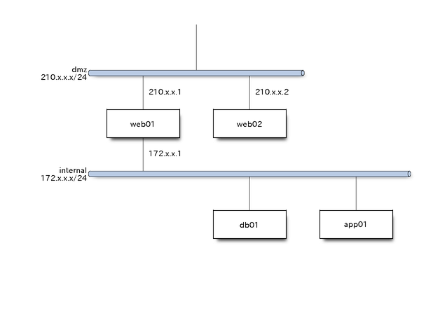
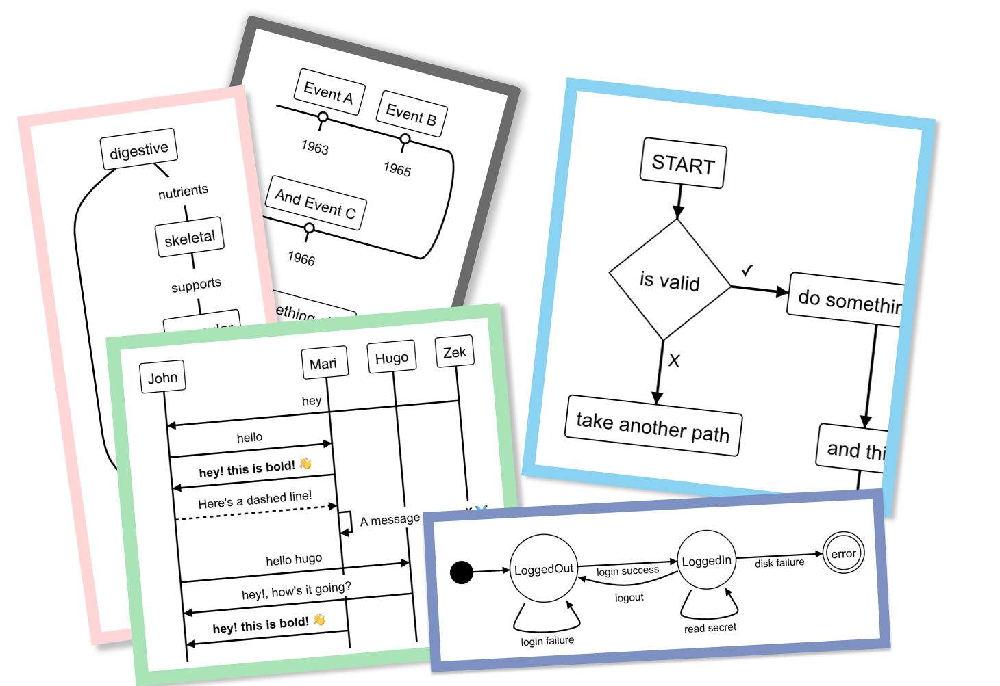
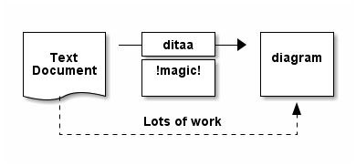
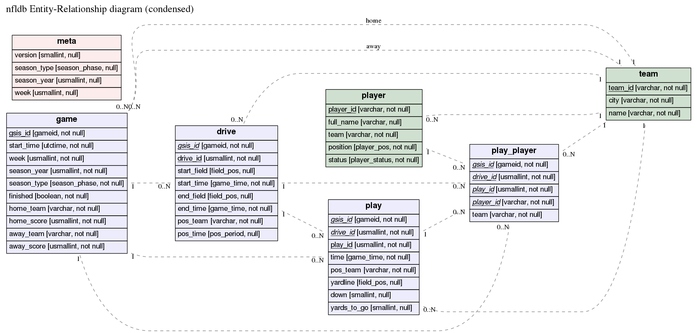

[TOC]


### ▣ ASCIIFlow

- [ASCIIFlow homepage](https://asciiflow.com/)

**ASCIIFlow** is an online tool to design text diagrams that you can export with ASCII
Characters. You can quickly create text diagrams for process flow, class hierarchy in
software development or UML diagrams, wireframes and then export the resulting diagram to
HTML or text.

Diagrams can be used with other tools like [ditaa](#ditaa) or [shaape](#shaape).

```
┌─────────────┐          ┌───────────────────┐
│             │          │                   │
│  DRAW WITH  │          │  EXPORT AS IMAGE  │
│             ├─────────►│    WITH DITAA     │
│  ASCIIFlow  │          │                   │
│             │          │                   │
└─────────────┘          └──────────┬────────┘
      ▲                             │
      │       FEEDBACK              │
      └─────────────────────────────┘
```


### ▣ Asymptote

- [Asymptote homepage](https://asymptote.sourceforge.io/)
- [Philippe Ivaldi's extensive Asymptote gallery](https://web.archive.org/web/20091202232015/http://www.piprime.fr/asymptote/)

**Asymptote** (The Vector Graphics Language) is a powerful descriptive vector graphics
language that provides a natural coordinate-based framework for technical drawing. Labels
and equations are typeset with LaTeX, for high-quality PostScript output.

Features of Asymptote:

 * A programming language, as opposed to just a graphics program

 * provides a portable standard for typesetting mathematical figures, just as TeX/LaTeX has
   become the standard for typesetting equations;

 * generates high-quality PostScript, PDF, SVG, or 3D PRC vector graphics;

 * embeds 3D vector PRC graphics within PDF files;

 * inspired by MetaPost, with a much cleaner, powerful C++-like programming syntax and IEEE
   floating-point numerics;

 * runs on all major platforms (UNIX, MacOS, Microsoft Windows);

 * mathematically oriented (e.g. rotation of vectors by complex multiplication);

 * LaTeX typesetting of labels (for document consistency);

 * uses simplex method and deferred drawing to solve overall size constraint issues between
   fixed-sized objects (labels and arrowheads) and objects that should scale with figure
   size;

 * fully generalizes MetaPost path construction algorithms to three dimensions;

 * compiles commands into virtual machine code for speed without sacrificing portability;

 * high-level graphics commands are implemented in the Asymptote language itself, allowing them to
   be easily tailored to specific applications.
   
See an example:


   

### ▣ Blockdiag

- [Blockdiag homepage](http://blockdiag.com/en/)

**Blockdiag** generates beautiful diagram images from simple text format (similar to
graphviz’s DOT format). Supports many types of diagrams

- block diagram (`blockdiag`)
- sequence diagram (`seqdiag`)
- activity diagram (`actdiag`)
- logical network diagram (`nwdiag`)

Layouts diagram elements automatically. Embeds to many documentations; 
Sphinx, Trac, Redmine and some wikis

See a sample:



### ▣ D2

- [D2](https://d2lang.com/tour/intro/)

**D2** is a diagram scripting language that turns text to diagrams. It stands
for Declarative Diagramming. Declarative, as in, you describe what you want
diagrammed, it generates the image.

For example, you provide this input on the left, and you get back the output on
the right.


### ▣ Diagram.Codes

- [Diagram.codes](https://www.diagram.codes/)

**Diagram.Codes** is a diagram generation tool. Describe your diagrams with a simple text
language and automatically generate an image you can export.  There are several class of
diagrams to generate: Graphs and hierarchies, time diagrams, mind maps, process modelling,
flow charts, state machines, onions layers, stacks, and accept suggestions on new types. For
example, the Flowchart Diagram allows yo to write this:

```
"START"
IF "is valid"
    "do this"
    "and that"
    IF "Is it good?"
    "Send email"
    ELSE
    "Save record"
    END IF
ELSE
    "take another path"
    "return"
ENDIF
```

And get this:


### ▣ Diagrams

- [Homepage](https://diagrams.mingrammer.com/)
- [Examples](https://diagrams.mingrammer.com/docs/examples)

**Diagrams** (Diagrams as code) lets you draw the cloud system architecture in Python code.
It was born for prototyping a new system architecture without any design tools. You can also
describe or visualize the existing system architecture as well. Diagram as Code allows you
to tracking the architecture diagram changes on any version control system. Currently
supports three major cloud providers: AWS, Azure, GCP.

See an example:




### ▣ Ditaa 

- [Ditaa Home page](http://ditaa.sourceforge.net/)
- [ASCII art diagrams](https://www.johndcook.com/blog/2016/06/14/ascii-art-diagrams/)


**Ditaa** (DIagrams Throught Ascii Art) is a small command-line utility written in Java,
that can convert diagrams drawn using ascii art ('drawings' that contain characters that
resemble lines like | / - ), into proper bitmap graphics. This is best illustrated by the
following example -- which also illustrates the benefits of using ditaa in comparison to
other methods :)

```
    +--------+   +-------+    +-------+
    |        | --+ ditaa +--> |       |
    |  Text  |   +-------+    |diagram|
    |Document|   |!magic!|    |       |
    |     {d}|   |       |    |       |
    +---+----+   +-------+    +-------+
        :                         ^
        |       Lots of work      |
        +-------------------------+
```

After conversion using ditaa, the above file becomes:
	



### ▣ ERD

- [ERD homepage](https://github.com/BurntSushi/erd)

**ERD** is a tool to translate a plain text description of a relational database schema to a
graphical entity-relationship diagram. This utility takes a plain text description of
entities, their attributes and the relationships between entities and produces a visual
diagram modeling the description. The visualization is produced by using Dot with GraphViz.
There are limited options for specifying color and font information. Also, ERD can output
graphs in a variety of formats, including but not limited to: pdf, svg, eps, png, jpg, plain
text and dot.

See an example:




### ▣ Graphviz


- [Graphviz homepage](https://graphviz.gitlab.io/)
- [Graphviz gallery](https://graphviz.gitlab.io/gallery/)
- [Graphviz examples](https://sketchviz.com/graphviz-examples)
- [Graphviz Documentation](https://graphviz.gitlab.io/documentation/)

**Graphviz** (Graph Visualization Software) is an open source graph visualization software.
Graph visualization is a way of representing structural information as diagrams of abstract
graphs and networks. It has important applications in networking, bioinformatics,  software
engineering, database and web design, machine learning, and in visual interfaces for other
technical domains. 

The Graphviz layout programs take descriptions of graphs in a simple text language, and make
diagrams in useful formats, such as images and SVG for web pages; PDF or Postscript for
inclusion in other documents; or display in an interactive graph browser.  Graphviz has many
useful features for concrete diagrams, such as options for colors, fonts, tabular node
layouts, line styles, hyperlinks, and custom shapes. 

See an example:


### ▣ Lolviz

- <https://github.com/parrt/lolviz>

A simple Python data-structure visualization tool for lists of lists, lists, dictionaries;
primarily for use in Jupyter notebooks / presentations (But could be used in any place)

A simple Python data-structure visualization tool that started out as a List Of Lists (lol)
visualizer but now handles arbitrary object graphs, including function call stacks!  lolviz
tries to look out for and format nicely common data structures such as lists, dictionaries,
linked lists, and binary trees. This package is primarily for use in teaching and
presentations with Jupyter notebooks, but could also be used for debugging data structures.
Useful for devoting machine learning data structures, such as decision trees, as well.

See an example:


### ▣ Mermaid

- [Mermaid home page](https://mermaidjs.github.io/)
- [Online editor](https://mermaidjs.github.io/mermaid-live-editor/)
- [mermaid.cli: Command-line interface for mermaid](https://github.com/mermaidjs/mermaid.cli)

**Mermaid** is a tool to generate diagrams and flowcharts from text, in a similar manner as
markdown, written in javascript. An editor is available for creating diagrams. With it you
can quickly start writing mermaid diagrams. It is possible to:

- save the result as a svg
- get a link to a viewer of the diagram
- get a link to edit of the diagram to share a diagram so that someone else can tweak it and send a new link back


See an example:


### ▣ PlantUML


- [PlantUML Homepage](http://plantuml.com/)
- [PlantUML online generator](http://www.plantuml.com/plantuml/uml/SoWkIImgAStDuNBAJrBGjLDmpCbCJbMmKiX8pSd91mlQwEf2HAqK79szkHnIyrA0wW40)
- [Interview with the author Arnaud Roques](https://modeling-languages.com/interview-plantuml/)
- [Drawing UML with PlantULM Handbook](http://plantuml.com/guide)


**PlantUML** is the most well-known UML tool in this category with millions of UML rendered.  We have
covered it in-depth in this interview with his creator  but, in short, it supports all important UML
diagrams (class, use case, activity, sequence, component, deployment and object diagrams but, to me,
the strong point of this tool is the variety of scenarios in which can be used. There’s a huge
ecosystem of tools around PlantUML to render textual UML diagrams anywhere you want.

See an example:


### ▣ Regex-Vis

- [Regex-Vis](https://regex-vis.com/)

**Regex-Vis** is a [Regular Expressions](https://en.wikipedia.org/wiki/Regular_expression) visualizer and editor, that make the regular expression easier to understand and debug. Form this expression:

```
(TF|GC)-?\d{4,5}-?[A-Z]
```

The outcome is:


### ▣ Shaape

- [Shaape homepage](https://github.com/christiangoltz/shaape)

**Shaape** is an ascii art to image converter designed to be used with asciidoc.  The word
**Shaape** itself is a neologism from **shape** and **ascii** art.

- Shaape is consistent between ascii source code and the produced image,
  What-You-See-Is-What-You-Generate

- Shaape supports a very natural form of ascii drawing (see the examples below) and attempts
  to keep the ascii source picture readable

- Shaape has an extensive feature set while maintaining a small and natural syntax

From this text imput:

```
    *----------*          
    *            *        
    |            |       
    |  A<----------+     
    |            | |     
    |       *----+-|---* 
    |      *     | |    *
    *      |union* |    |
    *-----+----*  |    |
        |       v    |  
        |       B    | 
        *            * 
            *----------*  

options:
- ".*": {frame:[[0, 0, 0, 0], 1]}
- "A": {fill:[[1,1,1,1],[0.4, 0, 0, 1]]}
- "B": {fill:[[0, 0, 0.4, 1],[1,1,1,1]]}
- "union": {fill:[[0.7, 0.2, 0.2, 1], [0.2, 0.2, 0.7, 1], no-shadow]}
```

You get this image:


See a more elaborated example:


### ▣ Sketchviz

- [Sketchviz homepage](https://sketchviz.com/)
- [Sketchviz about page](https://sketchviz.com/about)

**Sketchviz** is a free service provided by [Code 402, Inc](https://code402.com/). You can
use it anonymously, or connect to GitHub. If you connect to GitHub, you can use your saved
gists to embed Graphviz graphs in webpages. Graphs are rendered using the Graphviz graph
visualization tool but using a _sketchy_ style. Alos uses some hand-made like fonts: The
Tinos (default), Handlee and Sedgwick Ave font families can be used.

Let's see a sample. From this text:

```
# http://www.graphviz.org/content/cluster

digraph G {
  graph [fontname = "Handlee"];
  node [fontname = "Handlee"];
  edge [fontname = "Handlee"];

  bgcolor=transparent;

  subgraph cluster_0 {
    style=filled;
    color=lightgrey;
    node [style=filled,color=pink];
    a0 -> a1 -> a2 -> a3;
    label = "*process #1*";
    fontsize = 20;
  }

  subgraph cluster_1 {
    node [style=filled];
    b0 -> b1 -> b2 -> b3;
    label = "*process #2*";
    fontsize = 20;
    color=blue
  }
  start -> a0;
  start -> b0;
  a1 -> b3;
  b2 -> a3;
  a3 -> a0;
  a3 -> end;
  b3 -> end;

  start [shape=Mdiamond];
  end [shape=Msquare];
}
```

you get this image:


### ▣ Syntrax

- [Syntrax homepage](https://kevinpt.github.io/syntrax/)

**Syntrax** is a railroad diagram generator. It creates a visual illustration of the grammar
used for programming languages. A specification file describes the syntax as a hierarchy of
basic elements. This is processed into an image representing the same syntax with
interconnected nodes.

The specification is a set of nested Python function calls:

```
indentstack(10,
    line(opt('-'), choice('0', line('1-9', loop(None, '0-9'))),
    opt('.', loop('0-9', None))),
    line(opt(choice('e', 'E'), choice(None, '+', '-'), loop('0-9', None)))
)
```   

This is processed by Syntrax to generate an SVG image:


### ▣ TreeFlex

**[TreeFlex](https://dumptyd.github.io/treeflex/)** is a CSS library for drawing hierarchy trees


### ▣ TS Diagram

Generate diagrams based on Typescript

This input:

```tscript
interface Node {
  id: string;
  path: string;
  source: string;
  get meta(): Record<string, unknown>;
  get title(): string;
  get links(): Node[];
  get backlinks(): Node[];
  get tasks(): Task[];
};

interface Task {
  title: string;
  children: Task[];
  status: "default" | "active" | "done" | "cancelled";
  schedule: TaskSchedule;
  sessions: TaskSession[];
  get isInProgress(): boolean;
}

interface TaskSchedule {
  start: Date;
  end: Date;
  get duration(): number;
  get isCurrent(): boolean;
}

interface TaskSession {
  start: Date;
  end?: Date;
  get duration(): number;
  get isCurrent(): boolean;
}

class Wiki {
  rootPath: string;

  constructor(rootPath: string) {
    this.rootPath = rootPath;
  }

  getNodes(): Node[] {
    return [];
  }
}
```

Looks like:


### ▣ WaveDrom

- [Wavedrom homepage](https://wavedrom.com/)
- [Project source code in Github](https://github.com/wavedrom/wavedrom)

WaveDrom (Digital Timing Diagram everywhere) draws your Timing Diagram or Waveform from
simple textual description.  It comes with description language, rendering engine and the
editor.  WaveDrom editor works in the browser or can be installed on your system.  Rendering
engine can be embeded into any webpage.

a quick example. Following code will create 1-bit signal named "Alfa" that changes its state
over time.

```
{ signal: [{ name: "Alfa", wave: "01.zx=ud.23.456789" }] }
```

Every character in the "wave" string represents a single time period. Symbol "." extends previous state for one more period. Here is how it looks:


A more elaborated example:

This input:

```
{ signal: [
    { name: "clk",         wave: "p.....|..." },
    { name: "Data",        wave: "x.345x|=.x", data: ["head", "body", "tail", "data"] },
    { name: "Request",     wave: "0.1..0|1.0" },
    {},
    { name: "Acknowledge", wave: "1.....|01." }
]}
```

Generates this image:


### ▣ To do

- <https://gephi.org/users/quick-start/>


### More info

- [La manera más rápida de crear diagramas uml: 10+ herramientas online para el modelado textual](https://ingenieriadesoftware.es/la-manera-mas-rapida-de-crear-diagramas-uml-10-herramientas-online-para-el-modelado-textual/)

- [ASciidoctor Diagram](https://asciidoctor.org/docs/) - a set of Asciidoctor extensions that enable you to add diagrams, which you describe using plain text, to your AsciiDoc document.

- [Rough.js](https://roughjs.com/) - Create graphics with a hand-drawn, sketchy, appearance
	
