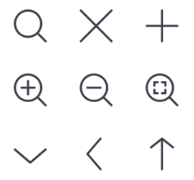
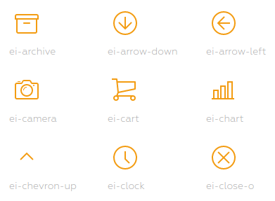
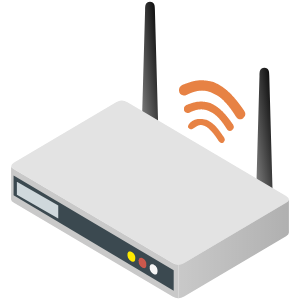
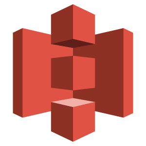

[TOC]

### ▣ Bytesize Icons

- [Bytesize Icons Repository](https://github.com/danklammer/bytesize-icons)

A tiny style-controlled SVG iconset. Each icon is hand-coded along a 32x32
grid, and uses SVG stroke allowing for maximum style flexibility; meaning you
can adjust the weight, color, size, and if you want the edges to be round or
square.

### ▣ Captain Icons

- [Captain Icons Repository](https://mariodelvalle.github.io/CaptainIconWeb/)

350 awesome free vector icons to empower your mobile and web designs

### ▣ Evil Icons

- [Evil Icons Home page](https://evil-icons.io/)

Simple and clean SVG icon pack with the code to support Rails, Sprockets,
Node.js, Gulp, Grunt and CDN.

### ▣ Feather

- [Feather icons](https://feathericons.com/)

Simply beautiful, customizable open source icons. Some samples:

- 
- 
- 

### ▣ Flaticon

- [Flaticon Home page](https://www.flaticon.com/)

Access +5.3M vector icons & stickers Download free vector icons and stickers
for your projects. Resources made by and for designers. PNG, SVG, EPS, PSD
and BASE 64 formats.

### ▣ Heroicons

- [Heroicons Home page](https://heroicons.dev/)
- [Heroicons Repository](<https://github.com/refactoringui/heroicons)

**Heroicons** is a set of free MIT-licensed high-quality SVG icons for you to
use in your web projects.

### ▣ Hugeicons

Beautiful icon library, made for creativity. +3,800 Free icons. +27.000
customizable Icons in the Pro package.

- [Hugeicons Home page](https://hugeicons.com/)

### ▣ Iconduck

- [Iconduck Home page](https://iconduck.com/)

Iconduck is a project to make open source icons and illustrations more
accessible. We've started doing this by collecting and tagging them, and
making them searchable.

### ▣ Captain Icons

350 awesome free vector icons to empower your mobile and web designs

### ▣ Icons8

- [Icons8 Home page](https://icons8.com/)
  
69,400 Free Flat Icons in any format, size and color in 20 seconds

### ▣ IconStore

- [IconStore Home page](https://iconstore.co/)

Free Icons by First-Class Designers

### ▣ Material Design Icons

- [Material Design Icons Home page](https://materialdesignicons.com/)

Material Design Icons' growing icon collection allows designers and
developers targeting various platforms to download icons in the format, color
and size they need for any project.

###  ▣ SVGL

- [Svgl Home page](https://svgl.vercel.app/)

A beautiful library with SVG logos - Svgl

Sample:

<svg width="128" height="128" xmlns="http://www.w3.org/2000/svg" viewBox="0 0 64 64">
  <g>
    <path fill="#323437" d="M0 16Q0 0 16 0h32q16 0 16 16v32q0 16-16 16H16Q0 64 0 48"/>
    <path fill="#e2b714" d="M9.09 24.1v21.2h5.12V33.1q.256-4.61 4.48-4.61 3.46.384 3.46 3.84v12.9h5.12v-11.5q-.128-5.25 4.48-5.25 3.46.384 3.46 3.84v12.9h5.12v-12.2q0-9.47-7.04-9.47-4.22 0-7.04 3.46-2.18-3.46-6.02-3.46-3.46 0-6.02 2.43v-2.05M47 18.9v5.12h-4.61v5.12H47v16.1h5.12v-16.1h4.61v-5.12h-4.61V18.9"/>
  </g>
</svg>

### ▣ Tabler Icons

- [Tabler icons Home page](https://tablericons.com/)

4825+ Fully customizable free SVG icons. (MIT license)

- Sample:

<svg xmlns="http://www.w3.org/2000/svg" class="icon icon-tabler icon-tabler-adjustments" width="128" height="128" viewBox="0 0 24 24" stroke-width="1.5" stroke="#009688" fill="none" stroke-linecap="round" stroke-linejoin="round">
  <path stroke="none" d="M0 0h24v24H0z"/>
  <circle cx="6" cy="10" r="2" />
  <line x1="6" y1="4" x2="6" y2="8" />
  <line x1="6" y1="12" x2="6" y2="20" />
  <circle cx="12" cy="16" r="2" />
  <line x1="12" y1="4" x2="12" y2="14" />
  <line x1="12" y1="18" x2="12" y2="20" />
  <circle cx="18" cy="7" r="2" />
  <line x1="18" y1="4" x2="18" y2="5" />
  <line x1="18" y1="9" x2="18" y2="20" />
</svg>

### ▣ The Noun Project

- [The Noun Project Home page](https://thenounproject.com/)

Icons for everything. Over 2 Million curated icons, created by a global community

### ▣ Vecta.io

- [Vecta.io Home page](https://vecta.io/symbols)

Flow chart, AWS, Google and Azure cloud symbols

Some samples:

